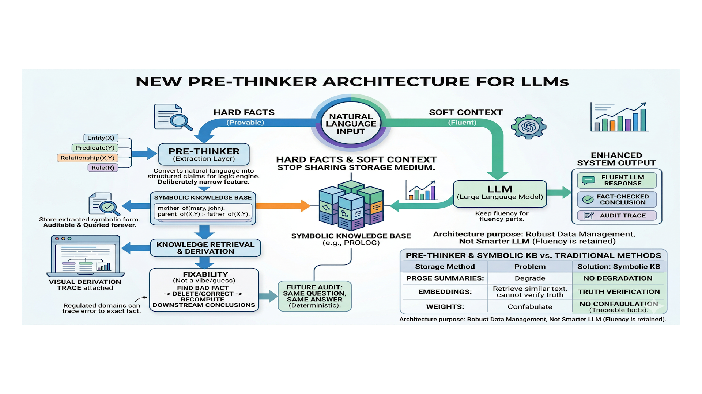

# Prolog Reasoning

**A Pre-Thinker for Neuro-Symbolic Knowledge Capture**

**Memories are timestamped. Facts are not. Hallucinations begin when facts collapse into memories.**

Prolog Reasoning is a local-first research and engineering repo focused on the write path of agent memory: how natural language should (or should not) become symbolic state.

Instead of treating memory as "retrieve more text," this project instruments the full language-to-state path: classification, normalization, validation, deterministic execution, and auditable explanation.

[](tests/)
[](https://www.python.org/)
[](LICENSE)

- Live docs hub: [dr3d.github.io/prolog-reasoning/docs-hub.html](https://dr3d.github.io/prolog-reasoning/docs-hub.html)
- Coding-agent fast start: [AGENT-README.md](AGENT-README.md)


## Why This Matters (NSAI)

Many agent stacks emphasize query quality. This repo emphasizes a harder failure point: **language -> state conversion**.

- Schema drift silently corrupts memory (`mother/2` vs `parent/2`).
- Uncertain language gets over-committed as hard fact.
- Runtime tool loops mutate state faster than teams can audit.

This project treats those as first-class engineering problems and builds explicit safety contracts around them.

## Core Thesis

The hardest problem is no longer query execution.
The hardest problem is deciding what language should become symbolic state.

## Architecture At A Glance

`incoming language -> pre-thinker proposal -> deterministic policy gates -> symbolic KB -> auditable derivations`




## Latest Pre-Thinker Drop (April 2026)

- Scenario narrative: [docs/research/scenarios/scenario-2.md](docs/research/scenarios/scenario-2.md)
- Edge-case dataset: [data/fact_extraction/prethinker_edge_cases_v1.json](data/fact_extraction/prethinker_edge_cases_v1.json)
- Edge runner: [scripts/run_prethinker_edge_matrix.py](scripts/run_prethinker_edge_matrix.py)
- Forward plan: [docs/research/pre-thinker.md](docs/research/pre-thinker.md)
- Published docs map: [docs/README.md](docs/README.md), [docs/docs-hub.html](docs/docs-hub.html)

Run the edge battery:

```bash
python scripts/run_prethinker_edge_matrix.py --dataset data/fact_extraction/prethinker_edge_cases_v1.json
```

Component roles:

- **Pre-thinker (emerging):** classifies utterances, proposes symbolic candidates, and flags uncertainty.
- **Deterministic policy layer:** decides what can be asserted, deferred, clarified, rejected, or retracted.
- **Symbolic core:** executes Prolog and propagation logic deterministically.
- **Explanation layer:** surfaces proof-oriented failure and success reasoning for auditability.

## What Is Real Today

Implemented and runnable now:

- Prolog interpreter and deterministic logic engine in [src/engine/core.py](src/engine/core.py)
- Constraint propagation engine in [src/engine/constraint_propagation.py](src/engine/constraint_propagation.py)
- Structured IR + schema validation in [src/ir/](src/ir/) and [src/validator/](src/validator/)
- Semantic grounding path in [src/parser/semantic.py](src/parser/semantic.py)
- Deterministic statement classification in [src/parser/statement_classifier.py](src/parser/statement_classifier.py)
- Failure translation in [src/explain/failure_translator.py](src/explain/failure_translator.py)
- MCP server integration in [src/mcp_server.py](src/mcp_server.py)
- Scenario and matrix research harnesses in [scripts/](scripts/)
- Current test baseline: `115 passed`

## Explicit Boundaries (Important)

Current runtime is intentionally conservative:

- `classify_statement` returns routing + `proposal_check`; it is not a durable write operation.
- MCP runtime mutation tools (`assert_fact`, `bulk_assert_facts`, `retract_fact`, `reset_kb`) are process-local simulation state.
- Runtime state resets to `prolog/core.pl`; durable journaled memory write-path is still an active build track.
- Pre-thinker LoRA and full write journaling are design/research tracks, not default runtime behavior today.

If you need production-persistent memory right now, treat this as a research lab and integration substrate, not a finished memory product.

## Quick Start

```bash
git clone <repo>
cd prolog-reasoning
pip install -r requirements.txt

# Baseline verification
python -m pytest tests -q
python scripts/check_docs_consistency.py

# Windows/PowerShell onboarding smoke
./scripts/pr1_smoke.ps1
```

## Evaluate The Project Like A Research System

Start with the docs that define the technical spine:

1. [docs/pre-thinker-control-plane.md](docs/pre-thinker-control-plane.md)
2. [docs/fact-intake-pipeline.md](docs/fact-intake-pipeline.md)
3. [docs/research/fact-ingestion-benchmark-matrix-spec.md](docs/research/fact-ingestion-benchmark-matrix-spec.md)
4. [docs/research/model-scenario-matrix.md](docs/research/model-scenario-matrix.md)
5. [docs/research/scenarios/README.md](docs/research/scenarios/README.md)

Then inspect concrete run artifacts:

- [docs/research/conversations/README.md](docs/research/conversations/README.md)

Historical archive (open only when you explicitly need old runs):

- [docs/research/legacy/README.md](docs/research/legacy/README.md)

Run a scenario capture (LM Studio required for live calls):

```bash
python scripts/run_conversaton.py \
  --conversation-file docs/research/scenarios/scenario-2.md \
  --continue-on-error
```

Dry-run parser check (no LM calls):

```bash
python scripts/run_conversaton.py \
  --conversation-file docs/research/scenarios/scenario-2.md \
  --dry-run
```

## Choose Your Path

### Use It

- MCP chat playbooks: [docs/mcp-chat-playbooks.md](docs/mcp-chat-playbooks.md)
- LM Studio MCP setup: [docs/lm-studio-mcp-guide.md](docs/lm-studio-mcp-guide.md)
- Launch-ops walkthrough: [docs/indie-launch-warroom-mcp-walkthrough.md](docs/indie-launch-warroom-mcp-walkthrough.md)
- Hermes install notes: [HERMES-AGENT-INSTALL.md](HERMES-AGENT-INSTALL.md)
- OpenClaw install notes: [OPENCLAW-AGENT-INSTALL.md](OPENCLAW-AGENT-INSTALL.md)

### Understand It

- Docs map: [docs/README.md](docs/README.md)
- Architecture overview: [architecture.md](architecture.md)
- Failure explanations: [docs/failure-explanations.md](docs/failure-explanations.md)
- Status and roadmap: [status.md](status.md), [roadmap.md](roadmap.md)
- Session tracker (compact): [sessions.md](sessions.md)

### Build On It

- Pre-thinker LoRA lane: [docs/research/prethinker-lora-playbook.md](docs/research/prethinker-lora-playbook.md)
- Collaboration lanes: [docs/research/collaboration-map.md](docs/research/collaboration-map.md)
- Conversation plan template: [docs/research/conversation-plan-template.json](docs/research/conversation-plan-template.json)
- Ontology routing track: [docs/secondary/ontology-context-routing-spec.md](docs/secondary/ontology-context-routing-spec.md)

## Repo Map

```text
src/
  engine/        Prolog interpreter and propagation engine
  ir/            Structured intermediate representation
  compiler/      IR to Prolog conversion
  parser/        Natural-language grounding and classification
  explain/       Proof traces and failure translation
  validator/     Semantic validation
  mcp_server.py  MCP integration

scripts/         Demos, capture runners, and research utilities
tests/           Unit and integration tests
data/            Benchmarks and evaluation artifacts
docs/            Design docs, guides, scenarios, and captured runs
prolog/          Knowledge-base files
training/        Beginner-facing learning materials
prototypes/      Experimental lanes and promotion tracks
mvp/             Experimental constraint graphics prototype
```

## Local LLM Integration

To expose MCP server via stdio:

```bash
python src/mcp_server.py --stdio
```

LM Studio typically launches this from `mcp.json`. Replace placeholders with your local values:

```json
{
  "mcpServers": {
    "prolog-reasoning": {
      "command": "<PYTHON_EXE>",
      "args": [
        "<REPO_ROOT>\\src\\mcp_server.py",
        "--stdio",
        "--kb-path",
        "<REPO_ROOT>\\prolog\\core.pl"
      ],
      "env": {
        "PYTHONIOENCODING": "utf-8"
      }
    }
  }
}
```

Relevant references:

- [docs/lm-studio-mcp-guide.md](docs/lm-studio-mcp-guide.md)
- [training/04-lm-studio-mcp.md](training/04-lm-studio-mcp.md)

## Constraint Propagation

Deterministic propagation supports known-state and domain-narrowing workflows:

```bash
python src/engine/runner.py --propagate --problem-json data/propagation_example.json
```

## Experimental Graphics Editor

The constraint graphics editor in [mvp](mvp/) is exploratory and not the project spine.

- [docs/prototypes/constraint-editor-mvp-playbook.md](docs/prototypes/constraint-editor-mvp-playbook.md)
- [prototypes/README.md](prototypes/README.md)

## Current Status

Current center of gravity:

- deterministic symbolic core is working
- write-path research is active and instrumented
- pre-thinker is the emerging control layer
- durable memory revision/journaling is the next major engineering frontier

For current state details and sequencing, see [status.md](status.md), [roadmap.md](roadmap.md), and [sessions.md](sessions.md).

## License

MIT License. See [LICENSE](LICENSE).
