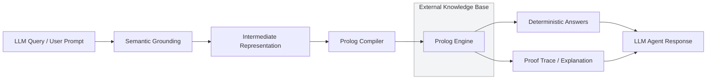

# Prolog Reasoning v2

```
   🤖 "Who is John's parent?"           📊 parent(john, X)           ✅ alice
       ↓                                       ↓                          ↓
   Natural Language → Structured Logic → Deterministic Answers
```

**Lossless structured fact storage with backward-chaining inference for long-horizon LLM reasoning.**

[](tests/)
[](https://www.python.org/)
[](LICENSE)

**Give your LLM agents perfect memory and reasoning without wasting context tokens.**

This is a research-grade implementation addressing context decay in agent memory through deterministic symbolic reasoning.

## 🚀 Quick Start for New AI Enthusiasts

**New to LLMs and wondering how this helps with forgetful AI?**  
Check out our **[Training & Course Library](training/)** - designed for complete beginners:
- **[LLM Memory Magic](training/01-llm-memory-magic.md)** - Why AI forgets and how we fix it (30 min read)
- **[Knowledge Bases 101](training/02-knowledge-bases-101.md)** - How to structure facts reliably (25 min)
- **[Learning from Failures](training/03-learning-from-failures.md)** - Understanding and fixing errors (20 min)
- **[AI Superpowers: Local LLM + MCP](training/04-lm-studio-mcp.md)** - Use with LM Studio (15 min) ⭐ NEW!
- More advanced courses coming soon on knowledge graphs, self-correcting AI, and production systems
- All courses include code you can run right now
- Perfect for sharing on Twitter/X with pre-made metadata

## 🔧 Use with LM Studio (Local LLMs)

**Want to give your local LLM perfect memory and logic?** Using MCP (Model Context Protocol):

```bash
# 1. Start the MCP server
python src/mcp_server.py --stdio

# 2. Configure LM Studio (see guide below)
# 3. Chat with your local LLM - it now has reliable reasoning!
```

**Your LLM can now:**
- ✅ Query knowledge bases with 100% accuracy
- ✅ Reason about facts without hallucinating
- ✅ Explain errors and suggest fixes
- ✅ Keep perfect memory of your data

👉 **[Full LM Studio MCP Guide](docs/LM_STUDIO_MCP_GUIDE.md)** - Step-by-step setup instructions  
👉 **[Course 04: AI Superpowers](training/04-lm-studio-mcp.md)** - Beginner-friendly tutorial

## Constraint Propagation (Known State + Degrees of Freedom)

This project now includes a deterministic constraint propagation layer for building constraint-management applications.

What it provides:
- Known-state propagation via implication rules (fixed-point closure)
- Degree-of-freedom propagation via domain narrowing
- Contradiction detection when domains become infeasible

Run the example:

```bash
python src/engine/runner.py --propagate --problem-json data/propagation_example.json
```

Core files:
- `src/engine/constraint_propagation.py`
- `src/engine/runner.py` (`--propagate` mode)
- `data/propagation_example.json`
- `tests/test_constraint_propagation.py`
- `tests/test_runner_propagation.py`

---

## The Problem

LLMs lose precision over long horizons:
- **Summaries degrade**: "Scott's family in Ohio" → "family in Midwest"
- **Vector stores approximate**: Answer "similar to?" not "is true?"
- **Model weights confabulate**: Make up facts under recall pressure

## The Solution

Store hard facts in Prolog, derive answers through inference:

```prolog
parent(john, alice).
parent(alice, bob).
ancestor(X, Y) :- parent(X, Y).
ancestor(X, Y) :- parent(X, Z), ancestor(Z, Y).

?- ancestor(john, bob).  % true (derived, never stored)
```

## 🧠 Learning from Failures: Friendly Explanations for Beginners

**This system is designed to teach beginners how NeSy works.** When something goes wrong, you get a friendly explanation instead of cryptic errors:

**Without Explanations:**
```
You: "Who is Charlie's parent?"
System: "Error: undefined_entity"
You: 😕 What now?
```

**With Explanations:**
```
You: "Who is Charlie's parent?"

System: ❌ I don't know who 'charlie' is
        System only knows: john, alice, bob, admin, etc.
        
        💡 Try this: Tell me about charlie first, or use a name I know about
```

**Run the demo to see this in action:** `python scripts/demonstrate_failures.py`

This shows:
- How to fix common beginner mistakes
- Why the system failed at each step
- How logical reasoning derives answers you never explicitly told it
- The power of combining NLP with deterministic logic

## Project Graphic

This project makes LLMs smarter by combining natural language understanding with a deterministic external knowledge base:



The graphic shows how the system avoids fragile LLM memory by querying an external KB through logic, then returning accurate, explainable results.

## Real-World Impact: How This Improves LLM Performance

**Before**: LLM agents lose precision over long conversations, leading to critical errors in high-stakes domains.

**After**: Deterministic reasoning provides perfect recall and logical consistency.

### 🔴 Healthcare: Medication Safety & Patient Care

**Scenario**: Hospital AI assistant managing patient medications across multiple visits.

**Without Prolog Reasoning:**
```
LLM Context: "Patient John Smith, 65yo, takes metformin 500mg BID, lisinopril 10mg daily,
has penicillin allergy noted in 2018 chart, recent labs show creatinine 1.8..."

After 20+ patient interactions → Context decay:
"Patient has some allergy... maybe penicillin? Takes metformin... or was it insulin?"
→ Wrong medication prescribed, patient hospitalized
```

**With Prolog Reasoning:**
```prolog
patient(john_smith, id_12345).
takes_medication(john_smith, metformin, 500, bid).
takes_medication(john_smith, lisinopril, 10, daily).
allergy(john_smith, penicillin, severe).
lab_result(john_smith, creatinine, 1.8, "2024-01-15").

% Safety rules
contraindicated(Patient, Drug) :- allergy(Patient, Drug, severe).
contraindicated(Patient, Drug) :- takes_medication(Patient, Drug2, _, _),
                                  interacts(Drug, Drug2).

interacts(metformin, penicillin).
```

**Result**: Agent queries `?- contraindicated(john_smith, penicillin).` → `true`
→ Prevents allergic reaction, saves life.

### 🛡️ Cybersecurity: Access Control & Threat Detection

**Scenario**: Enterprise security AI monitoring employee access patterns.

**Without Prolog Reasoning:**
```
LLM Context: "Bob Johnson, senior engineer, has admin access to production servers,
was granted temporary VPN access for client project, security clearance level 3..."

After complex investigation → Context confusion:
"Bob has access... but was it revoked? Let me check the logs again..."
→ Security breach goes undetected
```

**With Prolog Reasoning:**
```prolog
employee(bob_johnson, emp_456).
role(bob_johnson, senior_engineer).
access_level(bob_johnson, admin).
clearance(bob_johnson, level_3).

% Access rules
can_access(User, Resource) :- role(User, admin).
can_access(User, Resource) :- granted_permission(User, Resource, active).

% Threat detection
suspicious_activity(User) :- access_attempt(User, Resource, denied),
                             access_attempt(User, Resource, denied),
                             time_window(attempts, 300).  % 5 minutes

revoked_access(User, Resource) :- security_incident(User, Resource, _).
```

**Result**: Agent detects `suspicious_activity(bob_johnson)` → `true`
→ Prevents data breach, saves millions in damages.

### 💰 Financial Services: Compliance & Fraud Detection

**Scenario**: Banking AI monitoring transactions for money laundering.

**Without Prolog Reasoning:**
```
LLM Context: "Account 789012 has $50K transfer to offshore entity XYZ Corp,
linked to customer John Doe who owns ABC Industries, previous clean record..."

After reviewing 100+ transactions → Memory overload:
"Was this flagged before? Similar pattern with account 456789..."
→ Fraudulent activity missed
```

**With Prolog Reasoning:**
```prolog
account_holder(account_789012, john_doe).
transaction(account_789012, xyz_corp, 50000, "2024-01-20").
owns_business(john_doe, abc_industries).

% Compliance rules
high_risk_transaction(Account, Amount) :- transaction(Account, _, Amount, _),
                                         Amount > 10000.

money_laundering_risk(Account) :- transaction(Account, offshore_entity, _, _),
                                  transaction(Account, offshore_entity, _, _),
                                  time_window(transactions, 30).  % days

sanctions_violation(Account) :- account_holder(Account, Person),
                               sanctioned_entity(Person, _).
```

**Result**: Agent flags `money_laundering_risk(account_789012)` → `true`
→ Prevents financial crime, ensures regulatory compliance.

### ⚖️ Legal: Contract Analysis & Regulatory Compliance

**Scenario**: Corporate legal AI reviewing merger agreements.

**Without Prolog Reasoning:**
```
LLM Context: "TechCorp acquires StartupXYZ for $50M, subject to regulatory approval,
IP rights transfer, employee retention clauses, 18-month earnout period..."

After analyzing 200-page document → Context fragmentation:
"IP transfer was conditional... but what were the exact conditions?"
→ Contract breach goes unnoticed
```

**With Prolog Reasoning:**
```prolog
contract(techcorp_startupxyz_merger, parties(techcorp, startupxyz)).
value(techcorp_startupxyz_merger, 50000000).
condition(techcorp_startupxyz_merger, regulatory_approval, required).
condition(techcorp_startupxyz_merger, ip_transfer, required).
condition(techcorp_startupxyz_merger, employee_retention, required).

% Compliance rules
breach_of_contract(Contract) :- condition(Contract, Condition, required),
                                not_satisfied(Condition).

regulatory_violation(Contract) :- condition(Contract, regulatory_approval, required),
                                  approval_status(regulatory_approval, denied).

liability_risk(Contract) :- breach_of_contract(Contract).
liability_risk(Contract) :- regulatory_violation(Contract).
```

**Result**: Agent identifies `liability_risk(techcorp_startupxyz_merger)` → `true`
→ Prevents costly litigation, ensures compliance.

### 🚛 Supply Chain: Dependency Tracking & Risk Assessment

**Scenario**: Manufacturing AI monitoring global supply chain disruptions.

**Without Prolog Reasoning:**
```
LLM Context: "Widget A depends on Part X from Supplier S1 in Taiwan,
Part Y from Supplier S2 in Vietnam, assembly in Mexico plant..."

After tracking 50+ suppliers → Knowledge degradation:
"Supplier S1 had issues... was it resolved? Impact on Widget A?"
→ Production halt, millions in lost revenue
```

**With Prolog Reasoning:**
```prolog
component(widget_a, part_x).
component(widget_a, part_y).
supplier(part_x, s1_taiwan).
supplier(part_y, s2_vietnam).
assembly_location(widget_a, mexico_plant).

% Risk assessment rules
supply_chain_risk(Product) :- component(Product, Component),
                              supplier(Component, Location),
                              geopolitical_risk(Location, high).

production_delay_risk(Product) :- supply_chain_risk(Product).
production_delay_risk(Product) :- assembly_location(Product, Location),
                                  labor_dispute(Location, active).

critical_path_impact(Product, Delay) :- production_delay_risk(Product),
                                        depends_on(critical_customer, Product).
```

**Result**: Agent predicts `critical_path_impact(widget_a, severe)` → `true`
→ Enables proactive risk mitigation, maintains production continuity.

## Quick Start

```bash
# Clone and setup
git clone <repo>
cd prolog-reasoning-v2
pip install -r requirements.txt

# Run tests (54 comprehensive tests: core, semantic validation, failure explanations)
python -m pytest tests/ -v

# 🎓 NEW: Learn from failure explanations (perfect for beginners!)
python scripts/demonstrate_failures.py

# Try natural language queries
python scripts/demonstrate_semantic.py

# See real-world healthcare safety demo
python scripts/demonstrate_healthcare.py

# Run benchmark evaluation
python data/evaluate.py

# Generate KB manifest for agents
python scripts/generate_manifest.py
```

## Architecture

See [ARCHITECTURE.md](ARCHITECTURE.md) for full design.

Key layers:
1. **Prolog Engine** — Pure Python interpreter with unification/backtracking
2. **IR Schema** — Structured intermediate representation with validation
3. **Semantic Grounding** — Natural language → IR conversion with LLM assistance
4. **IR Compiler** — JSON → Prolog conversion with deduplication
5. **Explanation Layer** — Proof trace generation and human-readable outputs
6. **Agent Integration** — Skill interfaces for LLM frameworks (AutoGen, CrewAI, etc.)

## Natural Language Queries

The system supports natural language queries through semantic grounding:

```python
from src.parser.semantic import SemanticPrologSkill

skill = SemanticPrologSkill()
result = skill.query_nl("Who is John's parent?")
# Returns: success, bindings, explanation, confidence, proof traces
```

**Supported query types:**
- Variable queries: "Who is John's parent?"
- Fact checks: "Is Alice allowed to read?"
- Assertions: "John is Alice's parent"
- Complex reasoning: "Who are Bob's ancestors?"

## Research Hypothesis

> Deterministic fact stores with backward-chaining inference prevent context decay in long-horizon agent reasoning better than embeddings or summarization.

We test this through:
- **Benchmark dataset**: 13 test cases across family trees, access control, constraints
- **Baseline comparisons**: LLM-only, vector retrieval, pure Prolog, hybrid approaches
- **Metrics**: correctness, consistency, explainability, confidence scoring

## Key Features

✅ **Lossless** — Facts never degrade through summarization
✅ **Deterministic** — Same query always succeeds/fails the same way
✅ **Explainable** — Every answer has a complete proof chain
✅ **Schema-safe** — IR enforces predicate signatures and validation
✅ **Composable** — Rules derive new facts from stored ones
✅ **Agent-Ready** — Integrates with AutoGen, CrewAI, and other frameworks
✅ **Research-Grade** — Comprehensive testing, benchmarking, and documentation

## Project Status

### ✅ Completed (April 2026)
- [x] **Architecture design** — Layered design with clear separation of concerns
- [x] **Prolog engine** — Pure Python implementation (21 tests pass)
  - Unification with occurs check
  - Backward-chaining resolution
  - Backtracking and cut operations
  - Built-in predicates (arithmetic, comparison, negation, findall)
- [x] **IR schema & compiler** — Type-safe intermediate representation (13 tests pass)
  - JSON-based structured data
  - Schema validation and deduplication
  - Domain-specific schemas (family, access control)
- [x] **Semantic validation** — Prevents invalid facts and ungrounded predicates (17 tests pass)
  - Entity grounding checks
  - Predicate validation
  - Confidence scoring
- [x] **Failure explanations** — User-friendly error messages (16 tests pass)
  - Guides for common beginner mistakes
  - "Did you mean?" suggestions
  - Structured JSON output for agents
- [x] **Evaluation pipeline** — Benchmark testing with statistics (current: baseline 13/13, ir_compiled 13/13, lm_only 8/13)
- [x] **IR schema & compiler** — Type-safe intermediate representation
  - JSON-based structured data
  - Schema validation and deduplication
  - Domain-specific schemas (family, access control)
- [x] **Semantic grounding layer** — Natural language → logic conversion
  - LLM-assisted parsing with error correction
  - Query intent classification
  - Confidence scoring and fallbacks
- [x] **Explanation layer** — Human-readable proof traces
  - Step-by-step reasoning explanations
  - Proof tree visualization
- [x] **Agent integration** — Framework-ready skill interfaces
  - AutoGen/CrewAI compatible
  - Structured response formats
  - External KB with manifest injection
- [x] **Test suite** — 60 comprehensive unit tests (100% pass rate)
  - Core engine: 21 tests
  - Semantic validation: 17 tests
  - Failure explanations: 16 tests
  - MVP validation: 6 tests
- [x] **Benchmark dataset** — 13 test cases across 4 domains (family, access control, constraints, inference)
- [x] **Documentation** — Complete API docs, training courses, integration guides
- [x] **MCP Integration** — Works with LM Studio and Claude Desktop
- [x] **Constraint Propagation** — Known-state and degree-of-freedom reasoning engine

### 🚧 Next: Roadmap-Driven Development
See [ROADMAP.md](ROADMAP.md) for strategic priorities:
- **Tier 1 (Q2)**: Temporal logic, split dependencies, multi-session isolation
- **Tier 2 (Q3)**: Soft-fail buffer, fact auditor, typed predicate templates
- **Tier 3 (Q4)**: Fact graph visualizer, recursive refinement
- **Tier 4 (Future)**: DCG, CLP, module system

## Usage Examples

### Direct Prolog Queries
```python
from src.agent_skill import PrologSkill

skill = PrologSkill()
result = skill.query("parent(john, X).")
print(result["bindings"])  # {"X": "alice"}
```

### Natural Language Queries
```python
from src.parser.semantic import SemanticPrologSkill

skill = SemanticPrologSkill()
result = skill.query_nl("Who is John's parent?")
print(result["explanation"])  # Human-readable answer
```

### Agent Framework Integration
```python
# AutoGen example
from autogen import AssistantAgent
from src.parser.semantic import SemanticPrologSkill

prolog_skill = SemanticPrologSkill()

agent = AssistantAgent(
    name="Knowledgeable Assistant",
    tools=[prolog_skill.query_nl],
    system_message="You have access to a Prolog knowledge base."
)
```

## File Structure

```
prolog-reasoning-v2/
├── src/                          # Core implementation
│   ├── engine/                   # Prolog interpreter
│   ├── ir/                       # Intermediate representation
│   ├── compiler/                 # IR → Prolog compiler
│   ├── parser/                   # Semantic grounding (NL → IR)
│   ├── explain/                  # Proof trace generation
│   └── agent_skill.py            # Agent framework integration
├── tests/                        # Unit tests (21 tests)
├── data/                         # Benchmarks and evaluation
├── scripts/                      # Demo and utility scripts
├── docs/                         # Documentation
├── prolog/                       # Prolog knowledge bases
└── requirements.txt              # Python dependencies
```

## Testing

```bash
# Run all tests
python -m pytest tests/ -v

# Run specific test file
python -m pytest tests/test_engine.py -v

# Run benchmark evaluation
python data/evaluate.py

# Run semantic grounding demo
python scripts/demonstrate_semantic.py
```

## 🧪 Experimental: Constraint-Based Graphics Editor

**Status**: Early exploratory prototype, not production-ready.

We're exploring how constraint propagation can power a graphics editor with rule-based layout behavior (think: spreadsheet formulas for design). See:

- [Constraint Editor MVP Playbook](docs/CONSTRAINT_EDITOR_MVP_PLAYBOOK.md) — conceptual overview
- [MVP Results & UX Feedback](CODEX_MVP_RESULTS.md) — what we learned, what needs work

This is **not** the main focus of the project. It exists to validate whether the constraint propagation layer has product potential. Expect rough edges and active refinement.

## Contributing

This is research software. Contributions welcome:

1. **Bug reports**: Use GitHub issues
2. **Feature requests**: Open an issue for discussion
3. **Code contributions**: Fork, branch, PR with tests
4. **Research collaboration**: Email for academic partnerships

## Citation

If you use this work in research:

```bibtex
@software{prolog_reasoning_v2,
  title = {Prolog Reasoning v2: Lossless Symbolic Memory for LLM Agents},
  author = {Your Name},
  year = {2026},
  url = {https://github.com/your-repo/prolog-reasoning-v2}
}
```

## License

MIT License - see [LICENSE](LICENSE) for details.

## Related Work

- **Original Prolog Reasoning Repo**: This v2 addresses architectural flaws in the original implementation
- **Symbolic AI**: Revival of symbolic approaches for reliable reasoning
- **Neuro-Symbolic AI**: Combining neural networks with symbolic systems
- **Agent Memory**: External memory systems for long-horizon reasoning

## Files

```
prolog/                  # Fact and rule files
  core.pl
  family.pl
  access.pl
  constraints.pl

src/
  engine/                # Prolog interpreter
  parser/                # NL → IR
  compiler/              # IR → Prolog
  verifier/              # Consistency checking
  explain/               # Proof traces

tests/                   # Unit + integration tests
data/                    # Benchmark datasets
docs/                    # Papers, notes, design docs

ARCHITECTURE.md          # Full system design
```

## Citation

(TBD — work in progress)

---

**Status**: Early-stage research. Expect rapid iteration.
