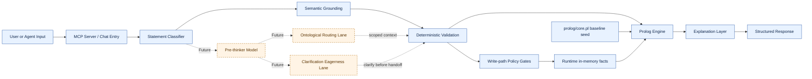

# Prolog Reasoning v2 - Architecture

Status: Current design snapshot  
Last updated: 2026-04-07

Legend:
- `Now` = implemented and active in current runtime.
- `Future` = documented direction, not active by default.

## 1. Core Design

This project separates three responsibilities:

1. Language interpretation and control decisions.
2. Deterministic policy for write/routing safety.
3. Symbolic reasoning for truth and inference.

The symbolic layer is the final authority on logical outcomes.  
Control layers can propose actions, but they do not bypass deterministic gates.

## 2. High-Level Runtime Flow

### 2.1 Architecture Diagram

Main query path (`Now`):

1. User input arrives (chat or MCP tool call).
2. Control layer classifies intent (`query`, `hard_fact`, `tentative_fact`, etc.).
3. Semantic grounding maps NL to structured query/assertion shape.
4. Deterministic validation checks entities, predicates, and compatibility.
5. Prolog engine executes query/inference.
6. Explanation layer returns structured result + guidance.

Planned control extension (`Future`):

1. Ontological routing lane selects/suggests active context and KB scope.
2. Clarification-eagerness lane may ask targeted clarification before handoff.
3. Deterministic write gates remain final authority.

## 3. Control Plane (Classifier / Pre-Thinker)

The pre-thinker is a role, not a fixed model type.

Current path (`Now`):
- deterministic classifier is production default.

Planned path (`Future`):
- small stateless pre-thinker model for routing/control outputs,
- optional LoRA tuning later after label schema stabilizes.

### 3.1 Two Adjacent Lanes

Lane A: Ontological routing (`Future`)
- infer active context,
- suggest context/KB switching,
- drive scoped retrieval/write policy.

Lane B: Clarification eagerness (`Future`)
- before model handoff, detect uncertain but relevant candidate facts,
- ask targeted clarification prompts ("did you mean ...?") when policy says to,
- require explicit confirmation for uncertain persistence.

Policy ownership:
- routing/policy layer owns `clarification_eagerness`,
- pre-thinker emits signals and candidate prompts.

Current runtime note (`Now`):
- `clarification_eagerness` exists as a no-op policy key (`0.0`) in metadata.
- behavior is intentionally unchanged until rollout.

## 4. Write-Path Safety Model

Memory operation model (`Now`):
- `assert`
- `tentative`
- `confirm`
- `retract`
- `supersede`

Safety invariants (`Now`):

1. Uncertain candidate facts are not auto-committed.
2. Deterministic validation gates run before durable mutation.
3. Clarification policy increases questions, not unsafe commits.

## 5. Knowledge Base Surfaces

Baseline seed KB (`Now`):
- `prolog/core.pl`
- loaded at startup and on `reset_kb`
- can be minimal/empty by design

Runtime mutable state (`Now`):
- in-memory assertions (`assert_fact`, `bulk_assert_facts`, `retract_fact`)
- resettable to seed baseline via `reset_kb`

## 6. Component Map

- `src/mcp_server.py` (`Now`)
  - MCP transport, tool registry, runtime orchestration, system metadata.
- `src/parser/statement_classifier.py` (`Now`)
  - deterministic control classification for routing/intake decisions.
- `src/parser/semantic.py` (`Now`)
  - NL grounding into structured query/assertion representation.
- `src/validator/semantic_validator.py` (`Now`)
  - semantic validation before execution.
- `src/engine/` (`Now`)
  - pure-Python logic engine and deterministic query execution.
- `src/explain/` (`Now`)
  - error explanation and failure translation.
- `docs/fact-intake-pipeline.md` (`Now`, policy spec)
  - canonical write-path and memory operation policy.
- `docs/pre-thinker-control-plane.md` (`Future`, design spec)
  - control-plane contract and rollout strategy.
- `docs/secondary/ontology-context-routing-spec.md` (`Future`, secondary track)
  - scoped context-routing and clarification-eagerness lane spec.
- `docs/secondary/clarification-eagerness-decision-table.md` (`Future`, policy table)
  - forward-looking deterministic action table.

## 7. Testing and Validation

Key validation layers (`Now`):

- unit tests under `tests/` for server/control/engine behavior.
- onboarding smoke captures under `scripts/` for live MCP path checks.
- surface validation includes explicit "no uncertain auto-commit" checks.

Primary smoke runner (`Now`):
- `scripts/onboarding_mcp_smoke.ps1`
  - hospital gate
  - fantasy gate
  - surface sanity gate

## 8. What Is Current vs Planned

Current (`Now`):
- deterministic symbolic reasoning and MCP tooling,
- deterministic statement classifier,
- scoped architecture docs for routing/control policies,
- no-op `clarification_eagerness` policy key present.

Planned (`Future`):
- pre-thinker model shadow mode,
- ontological routing rollout with context signals,
- clarification-eagerness behavior enablement after log-only validation,
- optional LoRA tuning after stable labels and benchmark gates.
