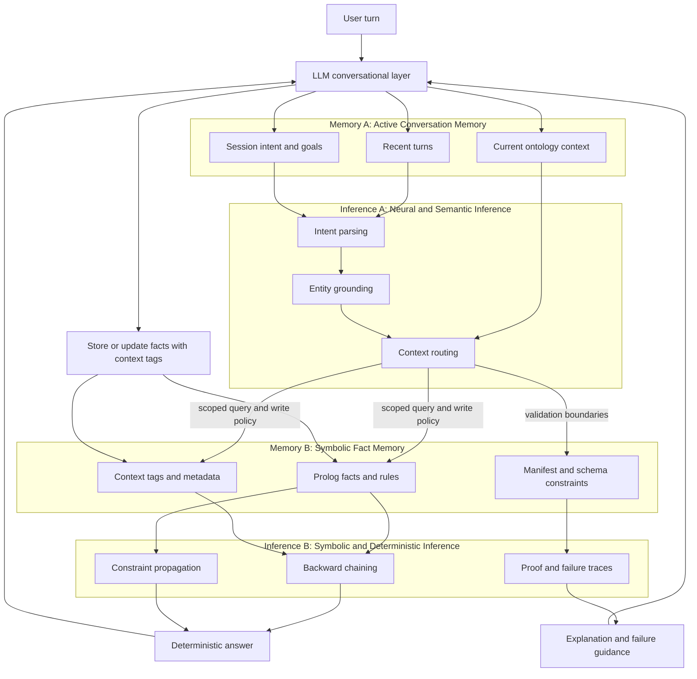

# 02 - Memory and Inference Map

This infographic captures the current architecture thinking around:
- two memory systems
- two inference systems
- how they cooperate per turn

## Reading Guide

1. Active conversation memory keeps short-horizon focus for the current turn.
2. Symbolic fact memory stores long-horizon truth and constraints.
3. Neural and semantic inference determines intent, grounding, and context scope.
4. Symbolic deterministic inference executes logic and produces reliable answers.
5. The LLM orchestrates both systems and records validated facts back into symbolic memory.

## Two Memory Modes

- Active conversation memory (short-term): transient, turn-focused, fast context shaping.
- Symbolic fact memory (long-term): persistent, structured, explicit truth maintenance.

## Two Inference Modes

- Neural and semantic inference: interpretation and routing under ambiguity.
- Symbolic deterministic inference: proof-driven reasoning with stable outcomes.

## Why This Split

- Better focus: scoped retrieval reduces irrelevant matches.
- Better reliability: final answers come from deterministic execution.
- Better explainability: proof traces and failure causes are explicit.
